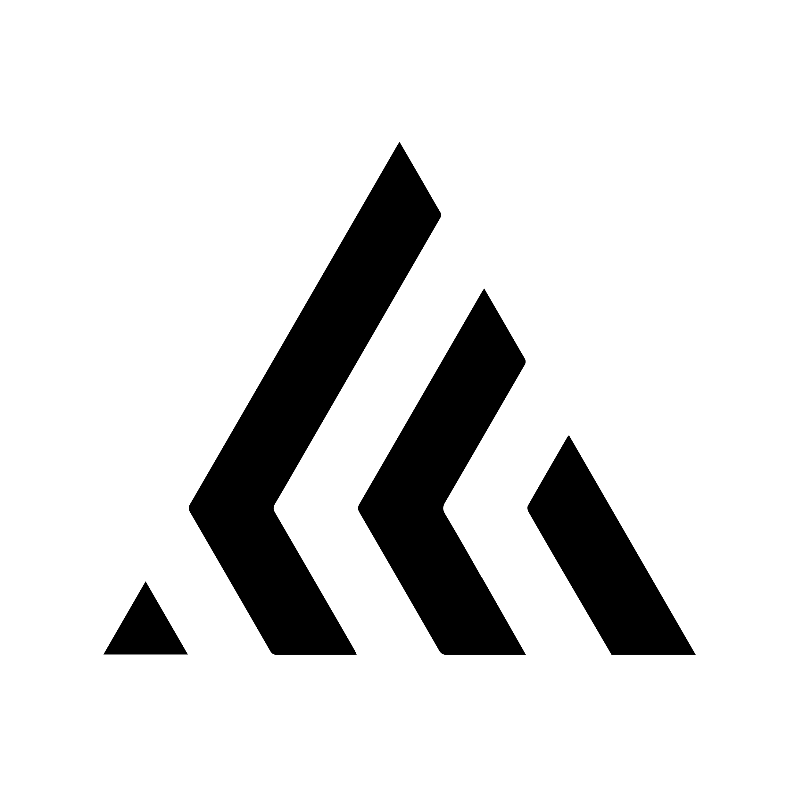

# [LockScript Vault](https://vault.lockscript.dev)  
An open-source secure credential vault for passwords, cards, notes, and PINs.

<p align="center">
  
</p>

---

## 🚀 Tech Stack

- **Framework**: Next.js  
- **Authentication**: Clerk  
- **Styling**: TailwindCSS  
- **Language**: TypeScript  
- **UI Components**: ShadCN  
- **ORM**: Prisma  
- **Validation**: Zod  

---

## 🛠 Getting Started

### Clone the Repository

```bash
git clone git@github.com:Lockscript/Lockscript-Vault
cd Lockscript-Vault
```

### Install Dependencies

This project uses yarn as the package manager.

[How to install Yarn](https://classic.yarnpkg.com/lang/en/docs/install/#windows-stable)

### Set Up Local Database (if required)

1. Start the Docker container (requires [Docker](https://docs.docker.com/engine/install/)):
    ```bash
    docker compose -f ./local-database.yml up -d
    ```

2. Generate the database client:
    ```bash
    yarn generate
    ```

3. Push the Prisma schema to the database:
    ```bash
    yarn push
    ```

### Create a Clerk Project

1. Go to the [Clerk Dashboard](https://dashboard.clerk.com).
2. Copy the `NEXT_PUBLIC_CLERK_PUBLISHABLE_KEY` and `CLERK_SECRET_KEY`.
3. Add them to your `.env` file.

### Start the Development Server

```bash
yarn dev
```

---
## 🤝 How to Contribute

We’re excited to have you contribute to LockScript Vault! Follow these steps to ensure your contributions are impactful and aligned with our project goals:

### 📝 Documentation
- Provide clear and concise documentation for any new features, updates, or bug fixes.
- Include code comments where necessary to explain non-obvious logic.

### 📦 Dependencies
- If you introduce new dependencies, ensure they are necessary and well-documented.
- Add a clear explanation of why the dependency was added in your pull request description.

### 🧪 Testing
- Thoroughly test your changes before submission.
- Write unit and integration tests for new features wherever applicable.
- Ensure that all existing tests pass by running:
    ```bash
    yarn build
    ```
---

## 📜 License

LockScript Vault is licensed under the [MIT License](./LICENSE), ensuring simplicity, flexibility, and freedom for contributors and users.

### What Does This Mean?
- **Free to Use:** You are free to use, copy, modify, merge, publish, and distribute the code for personal, educational, or commercial purposes.  
- **Attribution Required:** Any use of the code must include the original copyright notice.  
- **No Warranty:** The software is provided "as is," without any warranty, ensuring no liability for the maintainers.

The MIT License promotes open collaboration while giving you the freedom to innovate and build upon the project without restrictions.

For more details, view the full license text in the [LICENSE](./LICENSE) file.